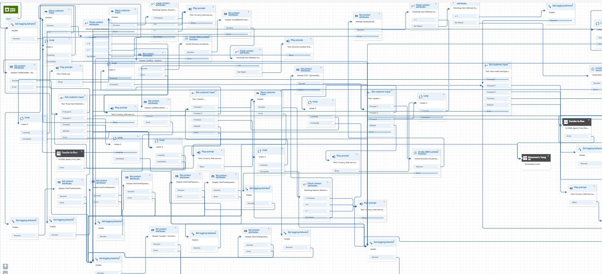
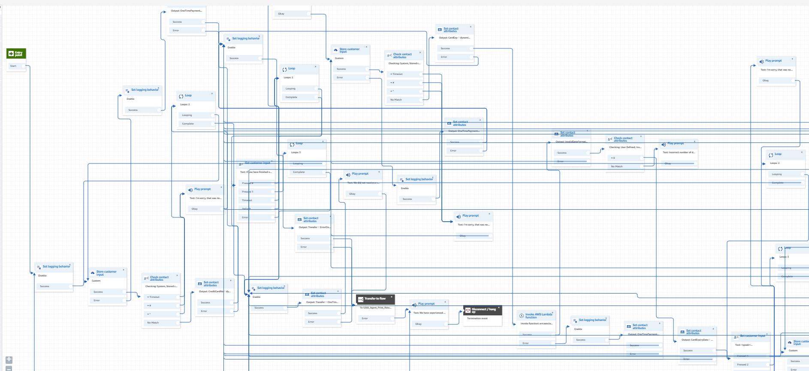

# Clean Contact Flow Lambda

This lambda is designed to be triggered from an s3 event, copies any files in the event, processes the presumed contact flows information in those files, and outputs to a set output prefix in the same bucket. The contact flows are processed based on depth and placed relatively in a grid. The algorithm is designed not to create a perfectly looking contact as Connect is unable to control where it draws edge lines, but rather to provide a quick way to sort out a large, messy contact flow to improve the productivity of any users editing them.

Example of before:


Example of after:


## Environment Variables

- **SSM_PARAM_PATH**: Name for SSM config parameters.
- **S3_OUTPUT_PREFIX**: The S3 prefix that the lambda will output to. The bucket it outputs to will always be the same one as it received it from.

## Config parameters for the algorithm

The config parameters for the algorithm processing the contact flows is stored in a SSM to allow for easier redeployment if you want to modify the lambda, or allow other services to easily change the config without going in the lambda environment variables.

### Parameter syntax

```
{
    "invert":true|false,
    "prioritize_depth":true|false,
    "set_loop_behaviour":true|false,
    "set_spread_behaviour":true|false,
    "depth_difference":250,
    "width_difference":250,
    "depth_offset":25,
    "width_offset":25,
    "entry": {
        "x":20,
        "y":500
    }
}
```

### Parameters

- **invert** (boolean): Inverts the placements of the nodes, having x and y swap places. This does not affect **entry**.
- **prioritize_depth** (boolean): If false, nodes will use the lowest depth they encounter when sorted by the algorithm and will result in contact flows looking more flattened and closer to the start. If true, nodes will use the highest depth they encounter when sorted and will result in contact flows looking more longer and narrow.
- **set_loop_behaviour** (boolean): Loops nodes back if the y position drifts too far from the 0 position from **depth_offset**.
- **set_spread_behaviour** (boolean): If set true, will try to spread nodes of equal depth out for longer distances.
- **depth_difference** (integer): The x distance to move every node based on depth
- **width_difference** (integer): The y distance to move every node based on width
- **depth_offset** (integer): The y distance to move every node based on depth
- **width_offset** (integer): The x distance to move every node based on width
- **entry** (dict):
